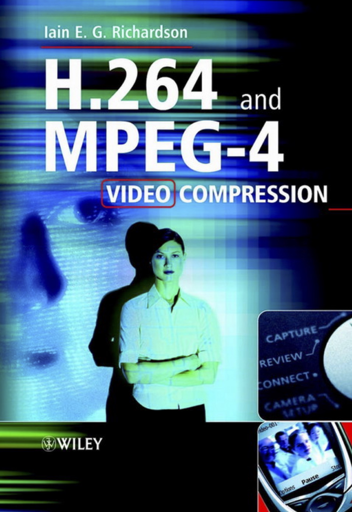
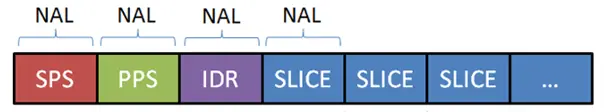
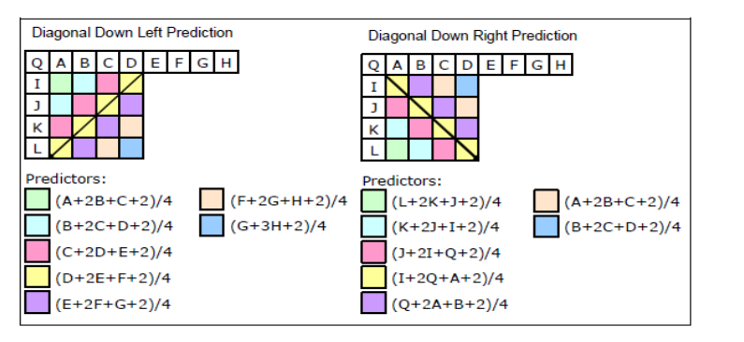
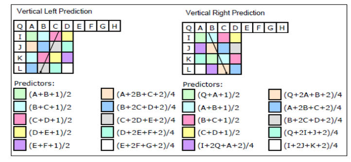
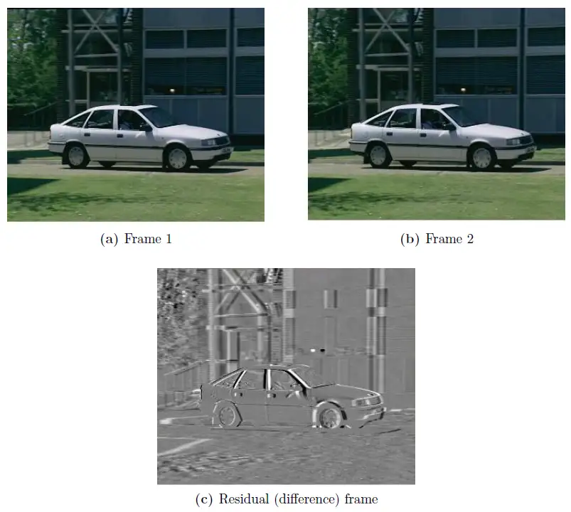

## Introduction

---

This tutorial is written in Chinese then tranlated to English, providing an introduction to H.264—also known as MPEG-4 Part 10 or Advanced Video Coding (AVC). It includes sample MATLAB code for practical learning. Each week, after introducing concepts, the tutorial features fill-in-the-blank exercises with the sample code to practice encoding and decoding actual data.

Given the complexity of the actual coding standard (the original document as of August 2021 is 844 pages long), this tutorial simplifies many aspects, which will be clearly noted. Furthermore, it assumes that the reader already has a basic understanding of image compression. This basic understanding typically encompasses all the steps of traditional JPEG, including basic concepts of image color transformation (RGB, YCrCb, YUV), Discrete Cosine Transform (DCT), quantization, and entropy coding. Thus, detailed explanations of these concepts will not be repeated; instead, the tutorial will focus on the unique improvements and implementations specific to H.264 in various blocks.

![ref: [13]](README_imgs/encoding.png)

ref: [13]

If you are not familiar with the basics of JPEG and image compression, consider consulting the following books:

[1] 酒井善則, 吉田俊之, and 白執善. 影像壓縮技術: 映像情報符號化. 全華, 2004

[2] Khalid Sayood. Introduction to data compression, 3rd, 2005.

The former is a Chinese-translated book (p.279), which is very helpful for quickly establishing a foundational knowledge of image compression. The latter covers the various facets of compression in a more general sense, including more extensive mathematical details (p.703).

Additionally, the main references for writing this document are from the two books mentioned below and various websites. The files and links for these books are included in the References section. While there is an abundance of information available online, its quality is inconsistent, and it often does more harm than good when dealing with the intricate task of studying coding standards. However, a single book also often cannot cover all details. This tutorial aims to serve as a guide, synthesizing a comprehensible outcome from the multitude of available data.

[3] Iain E Richardson. H. 264 and MPEG-4 video compression: video coding for

next-generation multimedia. John Wiley & Sons, 2004.

[4] Iain E Richardson. The H. 264 advanced video compression standard. John Wiley

& Sons, 2011.



.jpg)

It is recommended to directly read [4], as although it is written by the same author, [3] was published shortly after the completion of the protocol and devotes too much space to describing the previous protocol (MPEG-4) and its history. The content is somewhat mixed, with only one chapter (Ch6) focused on the details of H.264. In contrast, [4] is entirely dedicated to H.264, with more than three chapters discussing implementation details, supplemented by numerous examples.

H.264, introduced in 2003, has a 20-year history as of today. Its successors, H.265 High Efficiency Video Coding (HEVC) and H.266 Versatile Video Coding (VVC), were released in 2013 and 2020, respectively. However, as of 2024, H.264 still dominates the files circulating online. This prevalence is due to complex issues of copyright fees and compatibility. In my view, the current status of H.264 is similar to that of JPEG in images. Although better methods, like JPEG2000 and HEIF, are available, JPEG files are still widely circulated.

It is worth mentioning that Apple uses HEVC/H.265 format for videos and MPEG-H Part 12 HEIF format for photos, as detailed at [https://support.apple.com/zh-tw/116944](https://support.apple.com/zh-tw/116944). If using MacOS Preview, one can convert and export images in various formats, as shown in the figure:


Although Apple's Safari browser supports the display of JPEG2000 images, other mainstream browsers do not, and the images downloaded from Apple's own website are still in JPG format. Therefore, even though it is a very old encoding protocol, learning H.264 is similar to learning JPEG as a basic necessity for those entering the field of image compression. It serves as a foundational stepping stone for further exploration in the field of image compression.

## H.264 Overview

---

H.264 is a standard that defines the format for video compression. It provides a variety of tools for compression and transmission. In this section, we will briefly introduce the historical background of H.264 and outline the basic operations of H.264 encoders and decoders, as well as the complex elements like the compression syntax and headers. Most of these topics will be discussed in more detail in later chapters; here, we provide just a general overview.

H.264, officially known as H.264 MPEG-4 Part 10 or Advanced Video Coding (AVC), was released jointly by two international organizations: the ITU-T (International Telecommunication Union) and the ISO/IEC (International Organization for Standardization/International Electrotechnical Commission). Both organizations play a pivotal role in their fields, and there are many interesting historical developments worth exploring, which can be researched if intrested.

<aside>
 For those interested in history, additional reading can be found in [4] Chapter 1 and Chapter 4.

</aside>

H.264 defines the format and syntax for video compression and how to decode according to this format and syntax to produce playable sequences. Importantly, the standard document does not specifically dictate how to **"encode"**—this is left to the encoder developers and manufacturers, as long as the output is a bitstream that can be understood by a unified decoder. However, in practice, **encoders often include components of decoding**. (the reasons we will explain later). The specific scope of the H.264 standard can be seen in the figure below.

![ref: [4] Figure 4.1](README_imgs/%25E6%2588%25AA%25E5%259C%2596_2024-05-07_%25E6%2599%259A%25E4%25B8%258A11.55.23.png)

ref: [4] Figure 4.1

Introduced in 2003, H.264/AVC significantly outperformed all preceding codecs, which is why it still holds a dominant position in today's market. Despite the introduction of newer codecs with better performance, H.264/AVC remains mainstream due to factors like licensing costs and computational resources.

![ref: [6]](README_imgs/v2-0e051d64701754c67cfa0616b5b761ea_1440w-2.webp)

ref: [6]

H.264/AVC defines a variety of toolsets, known as different "Profiles." Essentially, there are three main Profiles:

- Baseline Profile
- Main Profile
- Extended Profile

![ref: [6]](README_imgs/v2-a2cfd81d7f30e624da990e8145a696fd_1440w.webp)

ref: [6]

Each Profile overlaps with others but caters to different application needs, providing a diverse range of options. We will not delve into the specific tools supported by each Profile right now; instead, we'll broadly discuss some of the concepts of H.264/AVC.

![ref: [4] Figure 4.4](README_imgs/%25E6%2588%25AA%25E5%259C%2596_2024-05-08_%25E4%25B8%25AD%25E5%258D%258812.30.12.png)

ref: [4] Figure 4.4

Like other video codecs, H.264/AVC begins by dividing data into blocks, here referred to as Macro Blocks (MBs). Unlike JPEG, which divides images into 8x8 blocks, the basic unit in H.264 is 16x16. Depending on the needs, further subdivision of these blocks may occur, details of which will be discussed later. From the diagram above, we can see the broad steps in the H.264 process:

<aside>
 CODEC: COmpress and DECompress

</aside>

1. **Splitting into Macro Blocks (MBs)**
2. **Prediction using either Intra or Inter techniques**
3. **Subtracting to get the Residual MB**
4. **Transform and Quantization**
5. **Entropy Coding to Bitstream**

Among these, Intra and Inter are concepts not found in traditional single-image compression—video differs from static images in that it contains temporal redundancy, meaning that adjacent frames often share high levels of similarity. Therefore, data compression can be further enhanced through this correlation. 'Intra' refers to using only spatial correlation without considering temporal elements (from other frames), while 'Inter' involves utilizing temporal correlations between frames.

<aside>
 Intra: using only spatial correlation without considering temporal elements.
Inter: utilizing temporal correlations between frames.

</aside>


As mentioned earlier, encoders typically include some decoding components, and now we can understand why: on the encoder side, correlations between frames are used to assist in compression. Since the uncompressed file is only accessible at the encoder end, to ensure consistency in the content referenced by both the encoder and decoder, the encoder uses results that have been compressed and then restored for reference, similar to what is shown in the diagram at the bottom left as "Previously coded frames or fields." Therefore, encoders incorporate all components of the decoder to ensure that both the encoder and decoder are referencing the same frames. This setup allows the encoder to predict and adjust the coding based on what the decoder will accurately produce, maintaining consistency and efficiency in the compression process.

![ref: [4] Figure 4.4](README_imgs/%25E6%2588%25AA%25E5%259C%2596_2024-05-08_%25E4%25B8%25AD%25E5%258D%258812.52.18.png)

ref: [4] Figure 4.4

---

As previously mentioned, H.264/AVC offers a variety of Profiles, each supporting different compression tools suited for various types of applications. Different types of applications often operate on different devices, which may have varying processor speeds and memory capacity limits. To ensure everything functions correctly, H.264 also introduces the concept of Levels to categorize the operational capabilities of applications, ensuring that decoders can accurately decode the current bitstream.

The combination of Profiles and Levels is numerous and complex, with detailed tables that can be quite complexicated. For more comprehensive information, it can be referred to [4] Chapter 5. Below is an example diagram that shows various Profiles (such as Baseline and Main) and Level parameters (such as Level 2, Level 2.2, and Level 3.1). 

![ref: [4] Figure 4.18](README_imgs/%25E6%2588%25AA%25E5%259C%2596_2024-05-08_%25E4%25B8%258B%25E5%258D%25881.01.24.png)

ref: [4] Figure 4.18

Overall, H.264/AVC is a complex standard that defines how a decoder interprets a bitstream. It specifies various Profiles and Levels to ensure smooth decoding processes. The major difference in encoding methods between video coding and single-image coding lies in leveraging the temporal correlation of video, which often allows for more significant compression.

Additionally, the concepts of macroblock partitioning, transform and quantization, and entropy coding in H.264 are similar to those used in image compression. In the upcoming chapters, we will delve deeper into the implementation details of these components, providing a thorough explanation of how each part contributes to the overall effectiveness and efficiency of the H.264 codec. 

## H.264 Syntax

---

H.264 provides a well-defined format or syntax for representing compressed video and related information. The diagram below outlines the structure of the H.264 syntax, which we will now explain. The matters involving headers and syntax are intricate and complex, so it's not feasible to cover everything in detail. Generally, we will discuss the major themes. For specific tables and examples, it is recommended to refer to Chapter 5 of the book [4] if more detailed understanding is required.

![ref: [4] Figure 5.1](README_imgs/%25E6%2588%25AA%25E5%259C%2596_2024-05-08_%25E4%25B8%258B%25E5%258D%25881.23.56.png)

ref: [4] Figure 5.1

For the top layer, the Network Abstraction Layer, H.264 uses sequences represented by Network Adaptation Layer units (NAL Units or NALUs). These packets can include parameter sets containing crucial parameters needed by the decoder to correctly decode the video data (such as Profile and Level information). The diagram below shows the structure of a sequence, including the Sequence Parameter Set (SPS) and Picture Parameter Set (PPS). For more information, you can refer to the following link:

[H264码流中SPS PPS详解](https://zhuanlan.zhihu.com/p/27896239)

An IDR frame (Instantaneous Decoder Refresh) is a special type of frame endowed with a specific function. It signals to the decoder that a new cycle is beginning, and no subsequent frames will refer back to any frames before the IDR. Thus, upon receiving an IDR frame, the decoder can immediately clear its current historical cache.

From the overview in Figure 5.1, we can see that the syntax of H.264/AVC adopts a hierarchical structure. Following the Sequence in the Network Abstraction Layer, there are additional layers such as the Slice Layer and the Macroblock Layer. Each layer's header provides essential information required for decoding.

In the Slice Header, the main information includes the Slice Type and Reference Picture List Reordering. To explain this content, we first need to clarify the distinctions between:

1. Decoding Order
2. Display Order
3. Reference Order

These three are distinct concepts in video coding. As mentioned earlier, the encoder includes components of the decoder. Every time an image frame is encoded, the decoder synchronizes the decoding and stores the result in the Decoded Picture Buffer (DPB) for future reference. However, the buffer size and computational resources are not unlimited, hence certain designs must be implemented to achieve an acceptable result. During referencing, H.264/AVC maintains two lists, known as list0 and list1, which are called Reference Picture Lists.

Before delving into the details of each Order, let's first introduce the concept of Slice Type:



![ref: [4] Table 5.9](README_imgs/%25E6%2588%25AA%25E5%259C%2596_2024-05-08_%25E4%25B8%258B%25E5%258D%25882.13.40.png)

ref: [4] Table 5.9

Among these, the I type, previously mentioned, operates in Intra mode, where prediction does not rely on other frames' information. In contrast, the P type utilizes frames from list0 for prediction, and the B type uses both list0 and list1. The SP and SI types will be omitted for now. With this knowledge, we can use the following diagram to understand the potential interactions among the aforementioned Orders:

![ref: [4] Figure 5.4](README_imgs/%25E6%2588%25AA%25E5%259C%2596_2024-05-08_%25E4%25B8%258B%25E5%258D%25882.52.01.png)

ref: [4] Figure 5.4

The I type can be decoded independently, so it is usually transmitted first to the other end. The P type generally references information from a past frame, so it needs to be transmitted after the frame it references. The B type, however, references frames from both the past and the future—hence, the Transmission Order and Display Order are typically not consistent. This requires careful design to avoid unnecessary delays.

This should give a basic understanding of Decoding Order and Display Order. Now let's discuss the Reference Order. Reference Pictures are stored in the Decoded Picture Buffer (DPB) and are categorized into:

1. Short term reference pictures
2. Long term reference pictures

These are differentiated by different indexing, as demonstrated in the example diagram below, 150, 151, ……, 157 are short term reference indexes, while long term references are marked as 1 and 3: 

![ref: [4] chapter5](README_imgs/%25E6%2588%25AA%25E5%259C%2596_2024-05-08_%25E4%25B8%258B%25E5%258D%25883.00.31.png)

ref: [4] chapter5

The Slice Layer Header provides information that allows the decoder to construct list0 and list1 based on the Decoded Picture Buffer (DPB). The example below illustrates how the decoder may utilizes the information from the Slice Layer Header to organize and update these lists:

![ref: [4] Figure 5.6](README_imgs/%25E6%2588%25AA%25E5%259C%2596_2024-05-08_%25E4%25B8%258B%25E5%258D%25883.05.31.png)

ref: [4] Figure 5.6

Summarizing the above, the main information contained in the Slice Header within the Slice Layer includes:

1. Slice Type (I, P, B)
2. Reference picture list reordering

Next, we will discuss the information contained in the Macroblock Layer. From the previous details, we can understand the hierarchical relationship of H.264/AVC as follows:

<aside>
 Sequence → Slice → Macroblock

</aside>

A sequence can be thought of as a series of frames, each frame can be divided into multiple slices, and each slice contains several macroblocks, which are the coding units after the image is segmented. The division of slices can be complex, but a simpler approach is to treat an entire frame as a single slice, avoiding the complication and confusion of having slices of types I, P, and B within the same frame. The examples of I, P, and B frames shown earlier are followed by this approach. If we further break down the hierarchy, it can be represented in the following diagram:

![ref: [6]](README_imgs/%25E6%2588%25AA%25E5%259C%2596_2024-05-08_%25E4%25B8%258B%25E5%258D%25884.16.39.png)

ref: [6]

<aside>
 Sequence → Group of Pictures (GOP) → Frame → Slice → MB → Sub-MB

</aside>

In addition to the previously discussed concepts, the Group of Pictures (GOP) is another important design aspect of H.264/AVC. H.264/AVC groups several frames together into a GOP, and the composition of a GOP depends entirely on the arrangement made by the encoder designer. The simplest approach is to fix a number, such as grouping every ten frames into one GOP, where the first frame is an I frame, and the remaining are P frames. The diagram below is an example of a GOP with a size of 4:

![ref: [6]](README_imgs/v2-92c86fa573d760cbfd28beb93b4c12dd_1440w.webp)

ref: [6]

Typically, because P frames leverage temporal redundancy, they achieve a higher compression rate compared to I frames. However, they can also accumulate errors in case of transmission errors. Additionally, during scenes with rapid movement, the differences between frames become significant, making references less effective and instead adding to the computational burden. Therefore, it's crucial not to indiscriminately increase the number of P frames. This involves complex design considerations.

For instance, one straightforward strategy is to adjust the GOP settings based on the current conditions of the video. In scenes with rapid movement where frames differ significantly and cannot provide effective reference information, the proportion of I frames can be increased. Conversely, in more static scenes, the proportion of P frames can be raised to optimize compression without compromising quality, as illustrated in the diagram below:

![ref: [6]](README_imgs/v2-5959eed3994ec1a21167f2db3d89d86d_1440w.webp)

ref: [6]

After understanding the information above, let's refer to the information in the Macroblock Header shown in the diagram below. Essentially, at this final stage of decoding, the Macroblock only needs to communicate the following to the decoder:

1. Macroblock Coding Type: I, P, B
2. Prediction Mode: Details of this are covered in the Prediction Chapter
3. QP (Quantization Parameter): This is related to the Quantization Chapter and affects the level of compression and the quality of the output video.

![ref: [6]](README_imgs/%25E6%2588%25AA%25E5%259C%2596_2024-05-08_%25E4%25B8%258B%25E5%258D%25884.03.16.png)

ref: [6]

Thus far, we have provided a general overview of how H.264/AVC organizes data hierarchically, not focusing on the detailed syntax to focus on the information each layer's header provides to the decoder. Next, we will use a tool called StreamEye to concretely display the bitstream of a video. Following that, we will delve into explanations of how prediction, transformation, quantization, and entropy coding are conducted on a macroblock basis.

## **Tool Introduction: StreamEye**

---

This tool is provided by Elecard:

[Video monitoring, analysis, encoding for IPTV, OTT and DVB | Elecard](https://www.elecard.com/)

After filling out some information, a basic version can be obtained for free:


Upon opening a video, we can review the content mentioned in the previous chapter. In the accompanying diagram example, we can see how the Decoded Picture Buffer (DPB) operates in B frames. Clicking on each Macroblock displays its header information on the right, and the entire video's information on the left, which includes the Network Abstraction Layer details mentioned in the previous chapter, such as video Profile, Level, Resolution, Frame Rate, etc. This is the content covered previously by the SPS and PPS.


Additionally, you can view the Slice Header in each Slice (here, 1 Frame = 1 Slice), which includes the Slice Type and some adjustments for Order (ref_pic_list_modification). Reviewing the content from the previous chapter should provide a more comprehensive understanding of the H.264/AVC syntax, although many intricate details are still omitted.


### Prediction Unit, PU

---

In image compression, prediction is commonly used to reduce redundancy: for each macroblock, the prediction attempts to replicate the current encoding macroblock's information using already encoded data. The efficiency and accuracy of this prediction significantly impact compression performance. For example, in JPEG, we perform differential coding on the DC coefficients of blocks. After this differential coding, the range of original values significantly decreases. The remaining information, referred to as the residual, has reduced energy. The smaller the energy of the residual, the fewer bits are needed for subsequent encoding. In the example below, aside from the first value, the data values after the differential(right) fall below 16.

$$
\begin{bmatrix}
78 & 72 & 81 \\
65 & 67 & 55 \\
59 & 44 & 48 \\
39 & 45 & 47 \\
\end{bmatrix} 
\qquad \Rightarrow \qquad
\begin{bmatrix}
78 & -6 & 9 \\
-16 & 2 & -12 \\
4 & -15 & 4 \\
-9 & 6 & 2 \\
\end{bmatrix}
$$

When making predictions, methods that are more complex and reference more surrounding information tend to provide more accurate predictions. However, if the cost of conveying the prediction is too high, the total amount of data may not decrease, requiring a balance between these two factors. Therefore, regardless of the prediction method used, it is necessary to consider:

1. Prediction efficiency
2. The cost of conveying the prediction

---

### Intra Prediction （I frame/slice/type）

As mentioned previously, in H.264, the I type MacroBlock (MB) is a category that does not require any other reference frames and compresses solely based on spatial redundancy. Typically, we can decode I frames independently without needing references from other frames, distinguishing them from P and B frames that do require references. The former is referred to as Intra, while the latter are referred to as Inter. Here, we will discuss how to predict a single MB in Intra mode. Since there are no other frames as references in Intra mode, prediction is made using areas of the other MB that have already been decoded. As shown in the diagram below, we might use the areas to the left or above the current block for prediction.

![ref: [4] Chapter 6](README_imgs/%25E6%2588%25AA%25E5%259C%2596_2024-05-13_%25E4%25B8%258B%25E5%258D%25883.57.41.png)

ref: [4] Chapter 6

Next, let's discuss Table 6.1 below. As previously mentioned in H.264, the basic unit size for a macroblock (MB) is 16x16, but further subdivision may occur depending on the situation. Here, we can see the possible ways blocks can be split during Intra Prediction. Among these, the 8x8 (luma) division is exclusive to High Profiles only. This tutorial primarily focuses on the Baseline Profile, with some minor content on Main and Extended Profiles. Therefore, we can entirely skip over the High Profile aspects for now.

![ref: [4] Table 6.1](README_imgs/%25E6%2588%25AA%25E5%259C%2596_2024-05-12_%25E6%2599%259A%25E4%25B8%258A9.18.43.png)

ref: [4] Table 6.1

For Intra Mode Luma Macroblocks, we see two size divisions: 16 x 16 and 4 x 4. This relates back to the previously mentioned consideration:

<aside>
 Regardless of the prediction method used, two factors must be considered:

1. Prediction efficiency
2. The cost of conveying the prediction
3. 傳達預測的成本
</aside>

It is obvious that dividing into smaller 4 x 4 blocks allows for more complex manipulations, potentially achieving better outcomes compared to 16 x 16 blocks. However, the cost of conveying predictions using 4 x 4 blocks is significantly higher than when using 16 x 16 blocks. Therefore, the encoder must weigh whether the overall cost of prediction and residual coding actually results in a minimal total bit count.

Referencing the example diagram below, we often find that in flat areas, it is easier to use the 16 x 16 method for prediction, while detailed areas benefit from the 4 x 4 prediction method to achieve better results.

![ref: [4] Figure 6.5](README_imgs/%25E6%2588%25AA%25E5%259C%2596_2024-05-13_%25E4%25B8%258B%25E5%258D%25884.03.34.png)

ref: [4] Figure 6.5

Before and after prediction, we can refer to the following set of images, which are arranged from left to right:

(1): Original image, (2): Prediction, (3): Residual after subtraction

![ref: [4] Figure 6.6](README_imgs/%25E6%2588%25AA%25E5%259C%2596_2024-05-28_%25E6%2599%259A%25E4%25B8%258A11.26.06.png)

ref: [4] Figure 6.6

![ref: [4] Figure 6.7](README_imgs/%25E6%2588%25AA%25E5%259C%2596_2024-05-28_%25E6%2599%259A%25E4%25B8%258A11.26.21.png)

ref: [4] Figure 6.7

![ref: [4] Figure 6.8](README_imgs/%25E6%2588%25AA%25E5%259C%2596_2024-05-28_%25E6%2599%259A%25E4%25B8%258A11.26.30.png)

ref: [4] Figure 6.8

Next, we will specifically introduce how 16 x 16 and 4 x 4 block prediction is performed in H.264.

### 4 x 4

---

![ref: [4] Figure 6.9](README_imgs/%25E6%2588%25AA%25E5%259C%2596_2024-05-13_%25E4%25B8%258B%25E5%258D%25884.14.25.png)

ref: [4] Figure 6.9

Consider the current 4 x 4 block, represented by lowercase letters in the diagram, while uppercase letters denote pixels that have already been decoded. In the 4 x 4 block of Intra mode, H.264/AVC offers 9 prediction methods:

![ref: [4] Figure 6.11](README_imgs/%25E6%2588%25AA%25E5%259C%2596_2024-05-13_%25E6%2599%259A%25E4%25B8%258A7.03.42.png)

ref: [4] Figure 6.11

In the encoder, it usually tries all nine modes for encoding and then selects the one with the smallest difference. Common metrics used to measure the difference include the Sum of Absolute Error (SAE). Here are some commonly used metrics:

- SAD (Sum of Absolute Difference) = SAE (Sum of Absolute Error)
- SATD (Sum of Absolute Transform Difference): Perform Hadamard Transform first, then calculate the absolute value
- SSD (Sum of Squared Difference) = SSE (Sum of Squared Error)
- MAD (Mean Absolute Difference) = MAE (Mean Absolute Error)
- MSD (Mean Squared Difference) = MSE (Mean Squared Error)

Next, let's look at a practical example. In the Figure below, we can see the nine prediction modes, each corresponding to a different SAE. In this example, mode 8 achieves the best SAE with a value of 203.

![ref: [4] Figure 6.12](README_imgs/%25E6%2588%25AA%25E5%259C%2596_2024-05-13_%25E6%2599%259A%25E4%25B8%258A7.13.41.png)

ref: [4] Figure 6.12

In practical implementation, besides modes 0, 1, and 2, the specific weighted calculations for the other modes can be referenced in the image below. It provides a detailed breakdown of how each pixel is calculated for every mode, showing the exact weighting operations used for each prediction mode.





![ref: [7]](README_imgs/44mode3.png)

ref: [7]

### 16 x 16

---

A 16 x 16 block contains 16 smaller 4 x 4 blocks. Naturally, the cost of conveying prediction information for a 16 x 16 block is much lower than that for individual 4 x 4 blocks. Additionally, H.264/AVC provides only four prediction modes for 16 x 16 blocks, further reducing the cost of conveying predictions and achieving better compression in flat areas. The four prediction modes for 16 x 16 blocks are shown in the diagram below:


![ref: [4] Figure 6.13](README_imgs/%25E6%2588%25AA%25E5%259C%2596_2024-05-13_%25E6%2599%259A%25E4%25B8%258A7.31.08.png)

ref: [4] Figure 6.13

Here, the only mode that requires additional explanation is mode 3 (plane mode). We can refer to the following:

| LT | L0 | L1 | L2 | L3 | L4 | L5 | …… | L14 | L15 |
| --- | --- | --- | --- | --- | --- | --- | --- | --- | --- |
| T0 | (0, 0) | (0, 1) | (0, 2) | (0, 3) | (0, 4) | (0, 5) | …… | (0, 14) | (0, 15) |
| T1 | (0, 0) | …… | …… | …… | …… | …… | …… | …… | (1, 15) |
| …… | …… | …… | …… | …… | …… | …… | …… | …… | …… |
| T15 | (15, 0) | (15, 1) | (15, 2) | (15, 3) | (15, 4) | (15, 5) | …… | (15, 14) | (15, 15) |

Among these, LT and T0, T1, ..., T15, and L0, L1, ..., L15 are the information already encoded before prediction. First, we calculate the following two values from this information:

$$
\begin{align*}
H' = 
& 1 * & (T_8 - T_6) & + \\
& 2 * & (T_9 - T_5) & + \\
& 3 * & (T_{10} - T_4) & + \\
& 4 * & (T_{11} - T_3) & + \\
& 5 * & (T_{12} - T_2) & + \\
& 6 * & (T_{13} - T_1) & + \\
& 7 * & (T_{14} - T_0) & + \\
& 8 * & (T_{15} - LT) & + \\
\end{align*}, \quad 
\begin{align*}
V' = 
& 1 * & (L_8 - L_6) & + \\
& 2 * & (L_9 - L_5) & + \\
& 3 * & (L_{10} - L_4) & + \\
& 4 * & (L_{11} - L_3) & + \\
& 5 * & (L_{12} - L_2) & + \\
& 6 * & (L_{13} - L_1) & + \\
& 7 * & (L_{14} - L_0) & + \\
& 8 * & (L_{15} - LT) & + \\
\end{align*}
$$

$$
H = (5 * H' + 32) / 64,
\quad V = (5 * V' + 32) / 64
$$

```matlab
a = 16 * (L15 + T15 + 1) - 7 * (V + H)

for i = 0 : 15
	for j = 0 : 15
			b = a + V * j + H * i;
			prediction[i, j] = uint8(b/32);
	end
end
```

Let's refer to a practical example. In the example, we can see that the prediction with the lowest SAE is achieved by prediction mode 3.

![ref: [4] Figure 6.15](README_imgs/%25E6%2588%25AA%25E5%259C%2596_2024-05-13_%25E6%2599%259A%25E4%25B8%258A8.19.33.png)

ref: [4] Figure 6.15

---

The above explanations are focused on Intra mode for Luma. For Chroma blocks, H.264 applies similar prediction modes and standardizes the block size to 8 x 8. It offers four prediction modes, identical to the 16 x 16 prediction modes for Luma, but the order is adjusted to: DC (mode 0), Horizontal (mode 1), Vertical (mode 2), and Plane (mode 3).

The reason for this order adjustment is related to frequency of occurrence. In practical encoding, the parameter indicating the prediction mode is itself predicted based on the previous block's prediction mode. This is because the prediction modes themselves exhibit a certain degree of correlation. In the Figure below, Block A, B, E may have the same prediction mode with high probablity:

![ref: [4] Figure 6.16](README_imgs/%25E6%2588%25AA%25E5%259C%2596_2024-05-13_%25E6%2599%259A%25E4%25B8%258A8.28.48.png)

ref: [4] Figure 6.16

This is also why 4 x 4 blocks have 9 prediction modes instead of $2^3 = 8$ modes. Below is a detailed explanation of the mechanism for predicting the Prediction mode. This mechanism applies only to 4 x 4 blocks with 9 prediction modes. For 16 x 16 Luma and 8 x 8 Chroma blocks with 4 prediction modes, this mechanism is not used because the bits required to express the prediction modes are already minimal.

The reference for the prediction mode of a block is the left and top blocks of the current block. As shown in the figure, Block E's references are Block A and Block B. The prediction algorithm is as follows:

1. a = prediction mode of Block A, b = prediction mode of Block B (Figure above)
2. Most probable mode : min(a, b)
3. if a or b is not available, set it to mode 2

Afterwards, the encoder calculates the SAE for all nine modes to find the best result. It then considers the most probable mode and the actual best mode for encoding. The encoding process is as follows:

The encoder transmits an additional bit for the prediction mode of each 4 x 4 block. If it is `'1'`, it means the best prediction mode matches the most probable mode, and no further information needs to be transmitted; the most probable mode is used directly.

If the modes do not match, the encoder sends a `'0'` followed by 3 bits `'XXX'` to indicate the actual best prediction mode. These 3 bits can represent the remaining 8 possible modes (excluding the most probable mode). The diagram below illustrates this: when the most probable mode is 1, the left side shows the 3 bits written by the encoder, and the right side shows the decoded prediction mode.

![ref: [4] Table 6.2](README_imgs/%25E6%2588%25AA%25E5%259C%2596_2024-05-13_%25E6%2599%259A%25E4%25B8%258A8.49.06.png)

ref: [4] Table 6.2

In this way, as long as the correlation between prediction modes is high enough, we can use 1 bit to transmit the prediction mode for most blocks, and only occasionally use 4 bits. This approach can slightly improve encoding efficiency compared to always using 3 bits.

This concludes the introduction to Intra Prediction. We now understand that:

- **Luma Block**:
    - 4 prediction modes for 16 x 16 block
    - 9 prediction modes for 4 x 4 block → also includes prediction for prediction mode
- **Chroma Block**:
    - 4 prediction modes for 8 x 8 block
    

All predictions are based on referencing the already encoded and decoded areas to the left and above. After calculating all prediction modes and subtracting from the actual data of the block being encoded, we obtain the residual. Finally, by considering the residual energy and the cost of transmitting prediction information, the optimal encoding mode is determined. This ensures that the final bitstream complies with the syntax understood by the H.264 decoder.

In the previous chapters, we have provided a general introduction to the syntax format headers, but we still need to cover the following:

<aside>
 After obtaining the residual, how to perform Transform, Quantization, and Entropy Coding

</aside>

These topics will be introduced in subsequent chapters. Next, we will explain Inter mode, which involves referencing information from other frames for prediction. Let's see how prediction is performed in Inter mode.

---

### Inter Prediction （P and B frame/slice/type）

As previously mentioned, P and B types refer to other fully encoded and decoded frames, indicated as "previously coded frames" in the bottom left corner of the diagram. These types use temporal redundancy in the video data, which typically results in better prediction compared to purely spatial redundancy.

In the Syntax chapter, it was mentioned that H.264 maintains a Decoded Picture Buffer (DPB) for reference and maps this buffer to two lists, list0 and list1. P frames use only one frame from list0, while B frames may use one frame from list0 or list1, both frames, or a weighted combination of both.

![ref: [4] Figure 4.4](README_imgs/%25E6%2588%25AA%25E5%259C%2596_2024-05-08_%25E4%25B8%25AD%25E5%258D%258812.52.18.png)

ref: [4] Figure 4.4

When performing inter-frame prediction (Inter Prediction), the steps may include:

1. Obtaining one (P) or multiple (B) reference images.
2. Performing precision Interpolation on the reference images.
3. Determining the size of the current prediction block (16 x 16 → 16 x 8, 8 x 16 → 8 x 8 → 8 x 4, 4 x 8 → 4 x 4), calculating Motion Estimation → Motion Compensation to obtain the Motion Vector.

There are various methods for Interpolation, and Motion Estimation, Motion Compensation, and Motion Vectors also have multiple variations. For instance, similar to the prediction mode in the previous chapter, the neighboring regions can also be correlated, allowing for prediction and further reducing redundancy. Below we will provide detailed introductions in sequence.

### 1. **Reference Pictures**

As previously mentioned, inter-frame prediction (Inter Prediction) utilizes previously encoded images available to the decoder. Segments are received and decoded to generate and display images. These images are also stored in the Decoded Picture Buffer (DPB). Typically:

| Reference Lists | Types | Reference Orderings |
| --- | --- | --- |
| list0 | P frame | infomation in past |
| list0 | B frame | infomation in past |
| list1 | B frame | infomation in future |

![ref: [12]](README_imgs/500px-I_P_and_B_frames.svg.png)

ref: [12]

Sometimes, parts of the scene are obscured due to changes in angle or the movement of objects. Referencing frames from different time points can mitigate this issue to some extent, as shown in the simple example above. However, the more references used, the greater the cost of conveying the prediction itself. Additionally, deciding which frame in the current list to use for prediction during encoding is a computationally intensive task that requires careful design.

### 2. **Interpolating Reference Pictures**

When obtaining the Motion Vector from reference images, a common issue is that the movement between the two frames does not align exactly with integer points. As shown in the diagram below, there is a noticeable displacement between the Current and Reference frames. However, if the reference range is limited to integer points, the result will be less accurate (simply copying the same infomation from the Reference frame while it’s actually rotated).

![ref: [6]](README_imgs/%25E6%2588%25AA%25E5%259C%2596_2024-05-14_%25E4%25B8%258A%25E5%258D%258811.21.02.png)

ref: [6]

Let's look at a practical example. From left to right, we have 4 x 4 blocks as the unit, applied to the same two images using normal precision, half-pixel precision, and quarter-pixel precision. Although the differences are subtle, there is a noticeable decrease in residual energy. Clearly, achieving this precision requires greater computational effort and higher costs to transmit the prediction information (Motion Vectors) obtained from the reference pictures. Understanding the role of Interpolation, let's introduce how H.264 handles Interpolation.

![ref: [4] Figure 3.15](README_imgs/%25E6%2588%25AA%25E5%259C%2596_2024-05-29_%25E5%2587%258C%25E6%2599%25A812.14.31.png)

ref: [4] Figure 3.15

![ref: [4] Figure 3.19](README_imgs/%25E6%2588%25AA%25E5%259C%2596_2024-05-29_%25E5%2587%258C%25E6%2599%25A812.06.33.png)

ref: [4] Figure 3.19

![ref: [4] Figure 3.20](README_imgs/%25E6%2588%25AA%25E5%259C%2596_2024-05-29_%25E5%2587%258C%25E6%2599%25A812.06.49.png)

ref: [4] Figure 3.20

### Luma component:

For the luma component, H.264 achieves quarter-pixel accuracy through two steps.

Step1:

![ref: [4] Figure 6.25](README_imgs/%25E6%2588%25AA%25E5%259C%2596_2024-05-14_%25E6%2599%259A%25E4%25B8%258A10.01.12.png)

ref: [4] Figure 6.25

In the figure above, the uppercase English letters represent the original pixel points. In the first step, we use a 6-tap Finite Impulse Response filter for interpolation calculations:

$$
\textbf{b} = \text{round}(\frac{E - 5 F+ 20 G + 20 H - 5 I + J}{32}) 
$$

Using this logic, the points aa, bb, b, s, gg, hh, cc, dd, h, m, ee, ff in the figure can all be successfully generated. The central point j can be generated in two ways, both yielding the same result:

$$
\textbf{j} = \text{round}(\frac{cc - 5 dd + 20 h + 20 m - 5 ee + ff}{32}) 
\\ = \text{round}(\frac{aa - 5 bb + 20 b + 20 s - 5 gg + hh}{32})
$$

After completing the half-pixel interpolation, moving to quarter-pixel interpolation involves a simple linear interpolation method:

![ref: [4] Figure 6.26](README_imgs/%25E6%2588%25AA%25E5%259C%2596_2024-05-14_%25E6%2599%259A%25E4%25B8%258A10.32.04.png)

ref: [4] Figure 6.26

$$
\begin{align*}
& \textbf{a} = \text{round}((G + b)/2) \\
& \textbf{d} = \text{round}((G + h)/2) \\
& \textbf{e} = \text{round}((b + h)/2)
\end{align*}
$$

---

### Chroma component:

Typically, H.264 uses a 4:2:0 sampling method. When luminance employs quarter-pixel accuracy, H.264 performs interpolation on the Chroma component using an eighth-pel approach. This ensures that Luma and Chroma have the same size range during motion prediction. The interpolation method used here is relatively simple:

![ref: [4] Figure 6.28](README_imgs/%25E6%2588%25AA%25E5%259C%2596_2024-05-14_%25E6%2599%259A%25E4%25B8%258A10.47.23.png)

ref: [4] Figure 6.28

$$
\textbf{a} = \text{round}(\frac{[(8 - d_x)(8 - d_y) A + d_x(8 - d_y) B + (8 - d_x) d_y C + d_xd_yD]}{64}) 
$$


$$
 = \text{round}(\frac{30A + 10B + 18C + 6D}{64})
$$

To this end, the explanation of interpolation in H.264 is complete. There are many methods of interpolation, including cutting-edge learning-based approaches that can achieve very high resolution. However, since the decoder's method of processing images in H.264 is fixed by protocol, unless the goal is not to create a general H.264 but to design your own encoder/decoder, there is no room for modification in interpolation; it must be done according to the methods described above.

---

### Macroblock Partitions

The MB (macroblock) unit in H.264 is fundamentally based on a 16 x 16 size, which is further subdivided depending on the situation. During Inter Prediction, the mechanism becomes much more complex compared to choosing between 16 x 16 and 4 x 4 in Intra Prediction. A 16 x 16 P/B type MB can be divided into:

1. One 16 x 16 block
2. Two 8 x 16 blocks
3. Two 16 x 8 blocks
4. Four 8 x 8 blocks

If option 4 is chosen, splitting into 8 x 8 blocks, the same subdivision steps can be applied again:

1. One 8 x 8 block
2. Two 4 x 8 blocks
3. Two 8 x 4 blocks
4. Four 4 x 4 blocks

![ref: [4] Figure 6.29](README_imgs/%25E6%2588%25AA%25E5%259C%2596_2024-05-14_%25E6%2599%259A%25E4%25B8%258A11.15.10.png)

ref: [4] Figure 6.29

Similarly, the finer the subdivision, the better the effect, but it will cost more to transmit the motion vector for each block. Below is a practical example, showing motion compensation using block sizes from 16 x 16, 8 x 8, to 4 x 4, moving from left to right. It is evident that there is a significant reduction in the residuals.

![ref: [4] Figure 3.13](README_imgs/%25E6%2588%25AA%25E5%259C%2596_2024-05-28_%25E6%2599%259A%25E4%25B8%258A11.32.18.png)

ref: [4] Figure 3.13

![ref: [4] Figure 3.14](README_imgs/%25E6%2588%25AA%25E5%259C%2596_2024-05-28_%25E6%2599%259A%25E4%25B8%258A11.32.29.png)

ref: [4] Figure 3.14

![ref: [4] Figure 3.15](README_imgs/%25E6%2588%25AA%25E5%259C%2596_2024-05-28_%25E6%2599%259A%25E4%25B8%258A11.32.36.png)

ref: [4] Figure 3.15

H.264 does not specify how to determine the partitioning method; it only defines the syntax that decoders can understand, allowing encoder designers to research how to achieve more efficient partitioning. The most intuitive approach is to try every possible partitioning, then select one based on the cost of transmitting the motion vector plus the cost of encoding the residuals. However, this approach consumes a lot of computational resources and encoding time, which is undesirable in many applications, such as real-time video conferencing where encoding time must be minimized.

Here's an introduction to a general compression concept: symmetric/asymmetric compression.

- **Symmetric compression** means that the time required by the encoder and decoder is roughly on the same scale.
- **Asymmetric compression** indicates that the encoder might consume significantly more computing power and time than the decoder—often yielding better results. This is why professional video outputs can take a long time to encode but are easy to play back, typifying asymmetric compression.

In H.264, the majority of the encoder's computational power is spent on traversing reference images and searching for motion compensation. After interpolation, even low-resolution images become computationally intensive. In the research table shown below, we can see that 95% of the computations occur in integer-pel Motion Estimation. If switched to quarter-pel accuracy, this number would increase even further.

![ref: [8]](README_imgs/%25E6%2588%25AA%25E5%259C%2596_2024-05-01_%25E4%25B8%258B%25E5%258D%25881.32.51.png)

ref: [8]

The previous discussion did not provide a comprehensive introduction to Motion Estimation, Motion Compensation, and Motion Vectors. Let's address that here.

![ref: [5]](README_imgs/v2-0068c00694feffb92a009bfce0fe2432_1440w.webp)

ref: [5]

Motion Estimation (figure above) refers to the process of searching for a block within a specified area of the reference frame that most closely matches the current encoding block—the current block. Once found, the difference in coordinates between the two frames is represented by a motion vector. Subtracting this block from the optimal reference block to obtain the smallest residual is known as Motion Compensation. The figure below provides an example of a motion vector and the motion compensated residual frame.



![ref: [5]](README_imgs/v2-7dafba154fa68ada447f040f6c484b61_1440w.webp)

ref: [5]

During motion estimation, the search range and methods are entirely up to the encoder designer's discretion, as long as the final output includes motion vectors and is encoded in a syntax understandable by the decoder. There are many search methods, but due to space limitations, we will not introduce them here. For those interested, please refer to the following link, which includes some classic algorithms and provides experimental tables on performance (Averaged Minimum Absolute Distance AMAD) and CPU time, allowing for a more concrete comparison of different methods in terms of efficiency and computational resources.

[Search Algorithms for Block-Matching in Motion Estimation](https://course.ece.cmu.edu/~ee899/project/deepak_mid.htm)

---

### Motion vector prediction

Like Intra prediction, the types of predictions themselves also exhibit spatial correlations (adjacent areas usually use the same prediction mode), which allows for further cost reduction through prediction. In Inter prediction, motion vectors also show significant spatial correlations, which is not hard to imagine. For example, as illustrated in the figure below, if the video features a moving car, all the macroblocks (MBs) surrounding the car should have consistent motion vectors.

![ref: [5]](README_imgs/v2-557cf6ab339adc118301e88a32042c26_1440w.webp)

ref: [5]

Due to the complexity and similarity to previously discussed concepts, we will skip the implementation details of this part here. For those interested, you can refer to the latter part of Chapter 6.4.4 (p.158) in the book [4]. With this, all the concepts used in Intra and Inter prediction have been fully explained.

### Deblocking Filter

---

The method of compressing and encoding an image by dividing it into blocks (macroblocks) commonly faces a problem: after decoding, boundaries tend to form at the edges of these blocks. As a result, a deblocking step is usually performed after decoding to mitigate this effect. By eliminating these boundaries, the image appears smoother and clearer to the human eye, as shown in the figure below:

![ref: [5]](README_imgs/v2-1fedfe4a55794bc9910bd3a20439c371_1440w.webp)

ref: [5]

Here, the concept of this filter is easy to understand but the process is complex, so it is omitted in this tutorial for brevity. Those interested can refer to Chapter 6.5 (p.171) of textbook [4] for more information. It is important to note that in video encoding, any operation must consider whether the encoding and decoding sides will have consistent information—if the reference frame used during encoding has gone through a deblocking filter before being stored, then the decoding must undergo the same process. For the H.264 baseline profile, the deblocking filter is an optional feature that consumes significant computational power on the decoding side, accounting for nearly one-third of the computational load. This is because a 16 x 16 block will undergo deblocking 8 times (as shown in the figures a, b, c, d, e, f, g, h):

![ref: [4] Figure 6.45](README_imgs/%25E6%2588%25AA%25E5%259C%2596_2024-05-15_%25E4%25B8%258A%25E5%258D%258811.51.15.png)

ref: [4] Figure 6.45

### Transformation and Quantization

---

In the previous chapter, we used various methods to predict blocks, aiming to transmit the predictive information at minimal cost and reduce the residual information as much as possible. Up to this point, the video remains lossless; by adding the predictive and residual information together, we can fully recover the original image, making it a reversible process. In the next steps, we will finally handle the residual information: the image minus the prediction, processed through a series of transformations and quantization, transforms the image into an efficiently storable and transmittable bitstream. From this step onwards, the image after decoding will differ from before encoding, and it can no longer be exactly converted back.

Similar to JPEG, we first transform the image into another space: in JPEG, we use the Discrete Cosine Transform (DCT) to shift information to the frequency domain. Since human eyes are less sensitive to high frequencies, during the subsequent quantization, it is possible to discard the least noticeable information first. In H.264, a similar transformation is used, but considering the higher computational costs of video compression compared to image compression, H.264 uses an Integer Discrete Cosine Transform, which is a slight modification of DCT that allows most calculations to be done using integer multiplicaions, even using shifts. Moreover, H.264 overlaps the quantization and transformation processes to save computational costs.

After transformation and quantization, we usually arrange the information in a certain way: in JPEG, the residual information is arranged in a zig-zag order, then processed using run-length encoding (RLE), and finally encoded using Huffman Coding. In H.264, similar operations are performed, followed by the use of various tools including fixed-length coding, Exponential-Golomb coding, Context Adaptive Variable Length Coding (CAVLC), and Context-adaptive Binary Arithmetic Coding (CABAC)

First, we will explain how H.264 performs the IDCT transform, similar to the DCT.

### Transform process

---

As previously emphasized, the H.264 protocol targets the decoder side. Therefore, we can first examine how the decoder operates after receiving a series of information:

![ref: [4] Figure 7.1](README_imgs/%25E6%2588%25AA%25E5%259C%2596_2024-05-15_%25E4%25B8%25AD%25E5%258D%258812.26.33.png)

ref: [4] Figure 7.1

We see that after receiving the final quantized coefficients, the decoder initially processes the DC coefficients (this is optional, and the usage context will be explained later). This is similar to JPEG, where we apply differential pulse-code modulation (DPCM) to the DC coefficients and then separately process the AC coefficients. After that, it goes through the normal inverse transformation process (inverse quantization and rescaling and inverse transform).

Similarly, omitting the implementation details of the transform and quantization, let’s first look at the steps experienced during encoding:

![ref: [4] Figure 7.3](README_imgs/%25E6%2588%25AA%25E5%259C%2596_2024-05-15_%25E4%25B8%25AD%25E5%258D%258812.30.15.png)

ref: [4] Figure 7.3

By default, no special processing is applied to the DC coefficients. In the Baseline Profile we are working with, only the Luma component in intra 16 x 16 and the Chroma component receive additional processing of DC coefficients (chroma block size is always 8 x 8):

![ref: [4] Figure 7.5](README_imgs/%25E6%2588%25AA%25E5%259C%2596_2024-05-15_%25E4%25B8%25AD%25E5%258D%258812.48.07.png)

ref: [4] Figure 7.5

![ref: [4] Figure 7.5](README_imgs/%25E6%2588%25AA%25E5%259C%2596_2024-05-15_%25E4%25B8%25AD%25E5%258D%258812.49.26.png)

ref: [4] Figure 7.5

The transform experienced by the DC coefficients is as follows:

$$
H_{Luma} = 
\begin{bmatrix}
1 & 1 & 1 & 1 \\
1 & 1 & -1 & -1 \\
1 & -1 & -1 & 1 \\
1 & -1 & 1 & -1 
\end{bmatrix}, \quad H_{Chroma} = 
\begin{bmatrix}
1 & 1  \\
1 & -1  \\
\end{bmatrix}
$$

---

Next, we will actually explain the process of transformation and quantization. From the division shown in the above figure, we know that the transformations are performed in 4 x 4 units, so a 16 x 16 block is divided into 16 individual 4 x 4 blocks. We can first take a general look at the upcoming processes and their inverse, and roughly imagine how H.264 saves on the number of multiplications by combining transformation and quantization:

forward transform:

![ref: [4] Figure 7.13](README_imgs/%25E6%2588%25AA%25E5%259C%2596_2024-05-15_%25E4%25B8%258B%25E5%258D%25881.12.59.png)

ref: [4] Figure 7.13

inverse transform:

![ref: [4] Figure 7.14](README_imgs/%25E6%2588%25AA%25E5%259C%2596_2024-05-15_%25E4%25B8%258B%25E5%258D%25881.22.46.png)

ref: [4] Figure 7.14

---

First, we will briefly derive the simplification process, starting from the 4 x 4 DCT matrix $U$, transforming it into the $C_{f4} \text{ and } S_{f4}$  from the steps mentioned in above figure:

$$
U = \begin{bmatrix}
a & a & a & a \\
b & c & -c & -b \\
a & -a & -a & a \\
c & -b & b & -c \\
\end{bmatrix}
$$

$$
a = 1/2, \quad b = \sqrt{1/2} \cos(\pi / 8) = 0.6532..., \quad c = \sqrt{1/2} \cos(3 \pi / 8) = 0.2706...
$$

We obtain the transformed data $Y$ by passing the original data $X$ through the DCT transformation.

$$
\bold Y = \bold U \cdot \bold X \cdot \bold U^{\bold T}
$$

We directly specify $C_{f4}$ as a matrix that can be computed entirely through shifts and additions.

$$
C_{f4} = \begin{bmatrix}
1 & 1 & 1 & 1 \\
2 & 1 & -1 & -2 \\
1 & -1 & -1 & 1 \\
1 & -2 & 2 & -1 \\
\end{bmatrix}
$$

To maintain the orthonormal property of the DCT, we can derive the following:

$$
U \approx C_{f4} \bullet R_{f4}, \quad R_{f4} = \begin{bmatrix}
1/2 & 1/2& 1/2 & 1/2 \\
1/\sqrt{10} & 1/\sqrt{10} & 1/\sqrt{10} & 1/\sqrt{10} \\
1/2 & 1/2& 1/2 & 1/2 \\
1/\sqrt{10} & 1/\sqrt{10} &1/\sqrt{10} & 1/\sqrt{10} \\
\end{bmatrix}
$$

$$
\bull \text{ means element-wise multiplication}
$$

Then we can obtain:

$$
\bold Y = \bold U \cdot \bold X \cdot \bold U^{\bold T} = [C_{f4} \cdot \bold X \cdot C_{f4}] \bull [R_{f4} \bull R_{f4}] = [C_{f4} \cdot \bold X \cdot C_{f4}] \bull S_{f4}
$$

We have obtained $C_{f4}$ and $S_{f4}$ in the forward transform. Using similar steps, we can derive $C_{i4}$ and $S_{i4}$ in the inverse transform.

$$
C_{i4} = \begin{bmatrix}
1 & 1 & 1 & 1 \\
1 & 1/2 & -1/2 & -1 \\
1 & -1 & -1 & 1 \\
1/2 & -1 & 1 & -1/2 \\
\end{bmatrix}, S_{i4} = 
\begin{bmatrix}
1/4 & 1/\sqrt{10} & 1/4 & 1/\sqrt{10} \\
1/\sqrt{10} & 2/5 & 1/\sqrt{10} & 2/5 \\
1/4 & 1/\sqrt{10} & 1/4 & 1/\sqrt{10} \\
1/\sqrt{10} & 2/5 & 1/\sqrt{10} & 2/5 \\
\end{bmatrix}
$$

---

Up to this point, we have most of the information from the steps shown in the above figure. Next, we'll explain the treatment of Quantization in H.264. Fundamentally, H.264's approach to Quantization differs greatly from JPEG's use of a fixed Quantization Table. In H.264, each block has its own QP parameter. In the example below, at the transform point, you can see that the QP on the left is 20, while on the right it is 15, with a delta_QP recording the difference between the two.


In our previous derivations, we have already gained a basic understanding of $C_f \text{ and } S_f$ derived from the DCT, and $C_i \text{ and } S_i$ derived from the IDCT. Now, integrating the QP parameters, we can further derive $M_f$  in the forward transform process and $V_i$ in the inverse transform process, starting with the derivation of $V_i$.

$$
V_{i4} \approx S_{i4} \cdot Q_{step} \cdot 2^6
$$

In this context, $Q_{step}$ is a parameter derived from QP, representing the quantization step. However, the protocol does not actually define $Q_{step}$; instead, it defines that the scaling matrix $V_i$ should be a function of QP. We can see:

$$
V_{i4} = S_{i4} \cdot Q_{step} \cdot 2^6 = \begin{bmatrix}
v(QP, 0) & v(QP, 2) & v(QP, 0) & v(QP, 2) \\
v(QP, 2) & v(QP, 1) & v(QP, 2) & v(QP, 1) \\
v(QP, 0) & v(QP, 2) & v(QP, 0) & v(QP, 2) \\
v(QP, 2) & v(QP, 1) & v(QP, 2) & v(QP, 1) \\
\end{bmatrix}
$$

$$
\text{Recall that }S_{i4} = \begin{bmatrix}
1/4 & 1/\sqrt{10} & 1/4 & 1/\sqrt{10} \\
1/\sqrt{10} & 2/5 & 1/\sqrt{10} & 2/5 \\
1/4 & 1/\sqrt{10} & 1/4 & 1/\sqrt{10} \\
1/\sqrt{10} & 2/5 & 1/\sqrt{10} & 2/5 \\
\end{bmatrix}, 
\quad \frac{1}{4} < \frac{1}{\sqrt{10}} < \frac{2}{5}
$$

Let’s see the following example when QP = [0, 5]:

![ref: [4] Table 7.1](README_imgs/%25E6%2588%25AA%25E5%259C%2596_2024-05-15_%25E4%25B8%258B%25E5%258D%25885.02.01.png)

ref: [4] Table 7.1

The above result can also be expressed in the form of a function of v:

![ref: [4] Table 7.2](README_imgs/%25E6%2588%25AA%25E5%259C%2596_2024-05-15_%25E4%25B8%258B%25E5%258D%25885.08.08.png)

ref: [4] Table 7.2

Furthermore, as previously mentioned, the protocol does not specify the relationship between $Q_{step}$ and QP, but only provides a table corresponding to $V_i$. Therefore, we can only deduce the values of both through the table $V_i$. From calculations, we can derive the table below, where 'n' is the column defined in the function $v$ from the above diagram (Table 7.2), aligned with the values of $S_{i4}$. There are slight variations at each point, which can be referenced by looking up the previously attached $S_{i4}$.

![ref: [4] Table 7.3](README_imgs/%25E6%2588%25AA%25E5%259C%2596_2024-05-15_%25E4%25B8%258B%25E5%258D%25885.16.27.png)

ref: [4] Table 7.3

For n = 0, the whole table can be shown as:

![ref: [5]](README_imgs/v2-38c38f3fc77ab64b6a2c0c99ecff55a3_1440w.webp)

ref: [5]

We can observe that the most important relationship between QP and Qstep is that for every increase of 6 in QP, the value of Qstep doubles:

| QP | Qstep |
| --- | --- |
| 0 | 0.625 |
| 6 | 1.25 |
| 12 | 2.5 |
| 18 | 5 |
| …… | …… |

Utilizing this property, in fact, H.264 only needs to maintain a 6 x 3 $v$ table to express all possible $V_{i4}$ tables corresponding to 52 QP values. You may first review the $v$ table above, and then look at the formula below:

$$
v(QP, n) = v(QP \% 6) \cdot 2^{\text{floor(QP/6)}}
$$

Since the $Q_{step}$ doubling for every 6-point increase in QP is consistent, we can use QP = 0-5 to calculate all corresponding $v$ values for QP from [0, 51]. Therefore, on the H.264 Decoder side, it only needs to maintain the 6 x 3 $v$ table mentioned above and can then obtain the correct $V_{i4}$ for all QP values through powers of two shifts to compute the answer:

| QP | v(QP, 0) | v(QP, 1) | v(QP, 2) |
| --- | --- | --- | --- |
| 0 | 10 | 16 | 13 |
| 1 | 11 | 18 | 14 |
| 2 | 13 | 20 | 16 |
| 3 | 14 | 23 | 18 |
| 4 | 16 | 25 | 20 |
| 5 | 18 | 29 | 23 |

---

We can derive $M_{f4}$ in the forward transform process in a similar manner. Since the process is almost identical, we will not elaborate further; those interested can refer to textbook [4] pages 193-195. Similarly, we can calculate a 6 x 3 $m$ table, and then find the corresponding coefficients for each QP value through powers of two shifts. The $m$ table is as follows:

| QP | m(QP, 0) | m(QP, 1) | m(QP, 2) |
| --- | --- | --- | --- |
| 0 | 13107 | 5243 | 8066 |
| 1 | 11916 | 4660 | 7490 |
| 2 | 10082 | 4194 | 6554 |
| 3 | 9362 | 3647 | 5825 |
| 4 | 8192 | 3355 | 5243 |
| 5 | 7282 | 2893 | 4559 |

$$
M_{f4} = \begin{bmatrix}
m(QP, 0) & m(QP, 2) & m(QP, 0) & m(QP, 2) \\
m(QP, 2) & m(QP, 1) & m(QP, 2) & m(QP, 1) \\
m(QP, 0) & m(QP, 2) & m(QP, 0) & m(QP, 2) \\
m(QP, 2) & m(QP, 1) & m(QP, 2) & m(QP, 1) \\
\end{bmatrix}
$$


$$
m(QP, n) = m(QP \% 6, n)/2^{\text{floor}(QP/6)}
$$

Next, we will look at a complete example, which concludes our explanation of the transformation and quantization section.

![ref: [4] Chapter 7](README_imgs/%25E6%2588%25AA%25E5%259C%2596_2024-05-15_%25E6%2599%259A%25E4%25B8%258A8.18.51.png)

ref: [4] Chapter 7

For QP = 6, we take the first row from the $m$ table to form the $M$ matrix.


![ref: [4] Chapter 7](README_imgs/%25E6%2588%25AA%25E5%259C%2596_2024-05-15_%25E6%2599%259A%25E4%25B8%258A8.31.38.png)

ref: [4] Chapter 7

Here, we can combine all the powers of two shifts into one term, and quickly perform the calculations using left and right shifts during implementation. Following the same steps, we can calculate the following data that is completed and decoded. (You can calculate on your own and compare with the answer below to ensure you have correctly understood the concept.)

![ref: [4] Chapter 7](README_imgs/%25E6%2588%25AA%25E5%259C%2596_2024-05-29_%25E5%2587%258C%25E6%2599%25A812.36.40.png)

ref: [4] Chapter 7

We can switch out the QP values and observe their impact on the transformed/inversely transformed values:


![ref: [4] Chapter 7](README_imgs/%25E6%2588%25AA%25E5%259C%2596_2024-05-15_%25E6%2599%259A%25E4%25B8%258A8.36.17.png)

ref: [4] Chapter 7

It is evident that the larger the QP, the more zeros appear after transformation and quantization, but the decoded output also loses more information accordingly. H.264 does not restrict how QP is assigned to each block; as long as the final syntax is understandable to the decoder, this is where the encoder designer can truly demonstrate their skills.

### Entropy Coding

---

H.264 considers various uses, including the various headers, predictive information (prediction modes, motion vectors, differences) mentioned earlier, and provides several entropy encoding methods for use, including:

1. Fixed-Length Coding
2. Exponential-Golomb Coding
3. Context-Adaptive Variable Length Coding (CAVLC)
4. Context-Adaptive Binary Arithmetic Coding (CABAC)

Fixed-Length Coding is typically used for some header information, as mentioned in the H.264 syntax. Its advantage is speed, but its efficiency is relatively low, and it will not be elaborated here. Next, we will sequentially explain the methods for the second and third method, and some references for the fourth method.

### Exponential-Golomb Coding

---

Exponential-Golomb Coding is not much more complex than Fixed-Length Coding.

![ref: [4] Chapter 7.9](README_imgs/%25E6%2588%25AA%25E5%259C%2596_2024-05-15_%25E6%2599%259A%25E4%25B8%258A9.08.34.png)

ref: [4] Chapter 7.9

It consists of:

$$
\text{code\_num} \longrightarrow  [\text{Zero Prefix}][1][\text{Info}]
$$


$$
\text{number of prefix zeros = M = floor}(\log_2[\text{code\_num + 1}])
$$


$$
\text{Info}=\text{code\_num} + 1 - 2^M
$$

---

### Context-Adaptive Variable Length Coding, CAVLC

---

In the CAVLC, before the data is officially converted into a bitstream of 0s and 1s, we first rearrange the data using a Zig-Zag scan. The diagram below shows the Zig-Zag pattern for 4 x 4 and 8 x 8:

![ref: [4] Chapter 7.17](README_imgs/%25E6%2588%25AA%25E5%259C%2596_2024-05-15_%25E6%2599%259A%25E4%25B8%258A8.45.12.png)

ref: [4] Chapter 7.17

CAVLC encodes in 4 x 4 units, and its basic concept is somewhat similar to JPEG. It also leverages the characteristic that after transformation and quantization, high frequencies are nearly all zeros. First, the data is reordered from low to high frequency in a Zig-Zag sequence. The common data types after transformation and quantization are as shown in the following figure, with the data after Zig-Zag reordering as follows:

$$
-8, 5, \red{0}, 1, 2, \red{0}, \red{0}, -1, 0, \ldots, 0
$$

![ref: [4] Chapter 7](README_imgs/%25E6%2588%25AA%25E5%259C%2596_2024-05-21_%25E6%2599%259A%25E4%25B8%258A10.36.53.png)

ref: [4] Chapter 7

![ref: [4] Chapter 7](README_imgs/%25E6%2588%25AA%25E5%259C%2596_2024-05-21_%25E6%2599%259A%25E4%25B8%258A10.37.59.png)

ref: [4] Chapter 7

In JPEG, we first simplify data through a Zero-Run approach, followed by Huffman Encoding. In CAVLC, the overall direction is the same, involving the omission of a large number of zeros at the high frequency end. However, CAVLC further collects characteristics of the data from that block and compresses it using different tables based on these characteristics. The information collected includes:

1. Non-zero Coefficients: In the example shown in the diagram, there are 5 non-zero coefficients. Additionally, we record the total number of zero coefficients occurring before the last non-zero coefficient, which in the example is 3 (indicated in red).
    
    <aside>
     The total number of non-zero coefficients is referred to as *TotalCoeffs* in the following text, with possible values ranging from [0, 16].
    The total number of zeros before the last non-zero coefficient is referred to as *TotalZeros*, with possible values ranging from [0, 15].
    
    </aside>
    
2. It has been observed that the last few high-frequency non-zero coefficients often include a high proportion of 1s and -1s. Therefore, CAVLC includes some additional processing for these last few 1s.
    
    <aside>
     The quantity of 1s and -1s among the highest frequency non-zero coefficients is referred to as *T1s* in the following text, with possible values ranging from [0, 3]; values exceeding 3 are represented as 3.
    
    </aside>
    
3. Typically, as we move towards lower frequencies, the values of non-zero coefficients gradually increase. CAVLC categorizes these coefficients by their magnitude, which allows it to flexibly adjust and reduce the amount of information that needs to be transmitted based on the data.
    
    <aside>
     This categorization is represented by *suffixLength* in the following text, which will be further explained.
    
    </aside>
    

---

For the Luma Component, CAVLC provides four different tables. The choice of which table to use is determined by a parameter called nC. The determination of nC takes into account information from the left and above the block. We can refer to the following algorithm to decide the nC for a block:

1. If left and up blocks are both available, nC = (nA + nB + 1) >> 1
2. If only up block is available, nC = nB
3. If only left block is available, nC = nA
4. If all near blocks are not available, nC = 0

![ref: [4] Chapter 7.19](README_imgs/%25E6%2588%25AA%25E5%259C%2596_2024-05-21_%25E6%2599%259A%25E4%25B8%258A10.59.40.png)

ref: [4] Chapter 7.19

After determining nC, the appropriate table is selected: Table 1 is more suitable for compressing situations with fewer TotalCoeffs. If the number of coefficients is sufficiently high, Fixed-Length Coding (FLC) — mentioned earlier — is used directly for compression.

![ref: [4] Table 7.11](README_imgs/%25E6%2588%25AA%25E5%259C%2596_2024-05-21_%25E6%2599%259A%25E4%25B8%258A11.02.53.png)

ref: [4] Table 7.11

Next, CAVLC references the two coefficients mentioned earlier, TotalCoeffs and T1s, to look up a string of bits from the table. These bits then convey the information (TotalCoeffs, T1) to the decoding side, explaining how to proceed with decoding. Describing this process in text is quite complex, so below we will directly illustrate the remaining steps with an example:

![ref: [4] Chapter 7 Example 1](README_imgs/%25E6%2588%25AA%25E5%259C%2596_2024-05-21_%25E6%2599%259A%25E4%25B8%258A11.15.35.png)

ref: [4] Chapter 7 Example 1

First, we obtain the three coefficients mentioned above, and here the previously mentioned nC is set to 0.

$$
TotalCoeffs = 5, \quad TotalZeros = 3, \quad T1s = 3
$$

Therefore, we refer to Table0, and from TotalCoeffs and T1s, we obtain the code `"0000100"`. Below is the actual content of Table0, which is a 17 x 4 table (the table comes from MATLAB, hence the index starts from 1). At position (6, 4), we can find the same code `"0000100"` as in the example.

![ref: [9]](README_imgs/%25E6%2588%25AA%25E5%259C%2596_2024-05-21_%25E6%2599%259A%25E4%25B8%258A11.39.33.png)

ref: [9]

Subsequently, since we have information about T1s on both encoder and decoder sides, the encoder can input the sign of the trailing 1s in the next {T1s} bits by `'0'` or `'1'`. After that, we encode the remaining non-zero coefficients, not considering the zeros in between. 

This is where the previously mentioned *suffixLength* parameter comes into play, which is dynamically adjusted. If TotalCoeffs > 10 and T1s == 3, *suffixLength* is initially set to 1; otherwise, it is set to 0. As shown in the following table, after encountering parameters that exceed a threshold, the suffixLength will dynamically increase.

![ref: [4] Table 7.12](README_imgs/%25E6%2588%25AA%25E5%259C%2596_2024-05-21_%25E6%2599%259A%25E4%25B8%258A11.47.08.png)

ref: [4] Table 7.12

The textbook only mentions how the suffixLength increases, but the details on how to generate the actual encoding results are rather vague. The tutorials available online also gloss over this part. By referencing documents JVT-C028 and T-REC-H.264-202108 p.240, as well as this MATLAB Sample Code, we can observe a quite complex process. We will not discuss it here in detail, but we can first refer to the table established in JVT-C028 [10]:

![ref: [10]](README_imgs/%25E6%2588%25AA%25E5%259C%2596_2024-05-22_%25E4%25B8%258A%25E5%258D%258811.18.33.png)

ref: [10]

![ref: [10]](README_imgs/%25E6%2588%25AA%25E5%259C%2596_2024-05-22_%25E4%25B8%258A%25E5%258D%258811.18.47.png)

ref: [10]

Based on the current Lev-VLC (which is the suffixLength), non-zero coefficients (Levels) are then encoded into Codes. Subsequently, we encode TotalZeros and Run_Before (the zeros interspersed among the coefficients), which involves using two additional tables.

TotalZeros are encoded using a 15 x 16 table, where 15 represents the possible values for non-zero coefficients *TotalCoeffs* from 1-15 (if it is 0 or 16, the encoding would already be complete without entering this step), and 16 corresponds to each possibility within *TotalZeros* [0, 15].

![ref: [9]](README_imgs/%25E6%2588%25AA%25E5%259C%2596_2024-05-22_%25E4%25B8%258B%25E5%258D%25883.57.31.png)

ref: [9]

This table is from MATLAB, so the indices are slightly adjusted. In the example above, we have:

$$
TotalCoeffs = 5, \quad TotalZeros = 3
$$

We can find the code `'111'` at the location (5, 4) for this example. The range for non-zero coefficients TotalCoeffs is 1-15, which can be used directly without adjusting the index here. However, the range for TotalZeros is [0, 15], so the index would be 3 + 1 = 4. The table from original protocol can also be referenced:

![ref: [11]](README_imgs/%25E6%2588%25AA%25E5%259C%2596_2024-05-22_%25E4%25B8%258B%25E5%258D%25884.23.52.png)

ref: [11]

![ref: [11]](README_imgs/%25E6%2588%25AA%25E5%259C%2596_2024-05-22_%25E4%25B8%258B%25E5%258D%25884.24.05.png)

ref: [11]

Subsequently, we use the last table to encode the Run_Before information, using a 15 x 7 table where the vertical axis represents the number of run_before 0s, and the horizontal axis represents the number of TotalZeros: if TotalZeros exceeds 6, the same coding is used.

![ref: [11]](README_imgs/%25E6%2588%25AA%25E5%259C%2596_2024-05-22_%25E4%25B8%258B%25E5%258D%25884.20.17.png)

ref: [11]

In the above example, we can sequentially obtain the encoded 'Code' from (1, 3), (0, 2), (0, 2), and (1, 2). Similarly, this table comes from the original protocol documents. If using MATLAB or another programming language for implementation, attention must be paid to details, especially when adjusting indices by adding or subtracting one at certain times (some ranges start from 1, others from 0).

With this, we have completed the introduction to the very complex full steps of CAVLC encoding and the tables used. Next, we will look at the decoding process, but as the content is repetitive, further explanation will not be provided here.

![ref: [4] Chapter 7](README_imgs/%25E6%2588%25AA%25E5%259C%2596_2024-05-22_%25E4%25B8%258B%25E5%258D%25884.14.58.png)

ref: [4] Chapter 7

Finally, we provide another example that includes some of the specially designed details of CAVLC. Since the explanation above has been quite lengthy, we will not elaborate further on this example. You can refer to the tables from earlier, try to write out the encoding results, and read the text in the example to understand its design process (**note** 1).


![ref: [4] Chapter 7 Example2](README_imgs/%25E6%2588%25AA%25E5%259C%2596_2024-05-22_%25E4%25B8%258B%25E5%258D%25884.17.33.png)

ref: [4] Chapter 7 Example2

---

### Context-Adaptive Binary Arithmetic Coding, CABAC

---

This entropy encoding is only used in the Main and High Profiles and is not covered in the Baseline Profile range that this tutorial aims to include. Like CAVLC, the CABAC encoding mechanism is very complex and would occupy a substantial portion of the text, hence it is omitted here. Those interested can refer to pages 217-220 of book [4] for more comprehensive information, as well as the following link:

[H.264/AVC Context Adaptive Binary Arithmetic Coding (CABAC) — Vcodex BV](https://www.vcodex.com/h264avc-context-adaptive-binary-arithmetic-coding-cabac)

[H.264中的CABAC编码原理_mvdx coding-CSDN博客](https://blog.csdn.net/yu_yuan_1314/article/details/8990619)

However, similarly, these articles often lack detailed practical implementation details, and sometimes it is necessary to consult the original protocol documents to obtain all the necessary tables and related information.

---

### Summary

---

After intra/inter prediction, the residual data blocks in the frame are transformed, quantized, scanned, and encoded. H.264 uses an improved version of the Discrete Cosine Transform (DCT), but through approximate enhancements, all steps can be achieved using shifts. It also combines the coefficients of the transformation with the quantization process to save costs and enable efficient implementation.

The H.264 encoder converts the video signal into a set of quantized transform coefficients, motion vectors, prediction, and header parameters. These values are encoded to produce a compressed bitstream. The encoder may choose to use Fixed-Length Coding for some elements, Exponential-Golomb Coding for others, and CAVLC or CABAC for still others, as long as they are within the protocol specifications, the decoder has the capability to recognize these encoding methods. However, achieving the most efficient encoding relies on the efforts and experiments of the encoder designer to balance computational resources, encoding efficiency, and execution time.

Thus, we have extensively introduced the implementation details of the H.264 Baseline Profile. Understanding the H.264 Baseline Profile essentially provides a foundation in video encoding, hence, advancing to the Main Profile, Extended Profile, and even H.265, merely involves adding more complex designs—more diverse prediction modes, more varied information from surroundings—to achieve marginal performance improvements while making the details exceedingly complex. At this point, referring directly to the original protocol documents is probably a more efficient approach.

Having fully understood the H.264 Baseline Profile, you should now be capable of reading complete documentation and locating the necessary information within an extensive eight-hundred-page protocol. If interested, you could also explore H.265 by referring to book [5], or search for classic or latest papers for further reading.

---

## Reference

---

[1] 酒井善則, 吉田俊之, and 白執善. 影像壓縮技術: 映像情報符號化. 全華, 2004

[2] Khalid Sayood. Introduction to data compression, 3rd, 2005.

[3] Iain E Richardson. H. 264 and MPEG-4 video compression: video coding for

next-generation multimedia. John Wiley & Sons, 2004.

[4] Iain E Richardson. The H. 264 advanced video compression standard. John Wiley

& Sons, 2011.

[5] Vivienne Sze, Madhukar Budagavi, and Gary J Sullivan. High efficiency video

coding (hevc). In Integrated circuit and systems, algorithms and architectures,

volume 39, page 40. Springer, 2014.

[6] [https://zhuanlan.zhihu.com/p/337205711](https://zhuanlan.zhihu.com/p/337205711)

[7] [https://www.cabidigitallibrary.org/doi/pdf/10.5555/20220168274](https://www.cabidigitallibrary.org/doi/pdf/10.5555/20220168274)

[8] Chen, Tung-Chien, et al. "Analysis and architecture design of an HDTV720p 30 frames/s H. 264/AVC encoder." *IEEE Transactions on Circuits and Systems for video technology* 16.6 (2006): 673-688. [https://ieeexplore.ieee.org/document/1637509](https://ieeexplore.ieee.org/document/1637509)

[9] [https://www.mathworks.com/matlabcentral/fileexchange/55901-h-264-baseline-codec-v2?s_tid=srchtitle](https://www.mathworks.com/matlabcentral/fileexchange/55901-h-264-baseline-codec-v2?s_tid=srchtitle)

[10] Joint Video Team (JVT) of ISO/IEC MPEG & ITU-T VCEG, Document: JVT-C028, Context-adaptive VLC (CVLC) coding of coefficients
[11] ITU-T H.264(08/2021) Advanced video coding for generic audiovisual services  ****[https://www.itu.int/rec/T-REC-H.264-202108-I/en](https://www.itu.int/rec/T-REC-H.264-202108-I/en)

[12] [https://github.com/leandromoreira/digital_video_introduction/blob/master/README-cn.md#自己动手检查-ycbcr-直方图](https://github.com/leandromoreira/digital_video_introduction/blob/master/README-cn.md#%E8%87%AA%E5%B7%B1%E5%8A%A8%E6%89%8B%E6%A3%80%E6%9F%A5-ycbcr-%E7%9B%B4%E6%96%B9%E5%9B%BE)

[13] [https://yasoob.me/posts/understanding-and-writing-jpeg-decoder-in-python/](https://yasoob.me/posts/understanding-and-writing-jpeg-decoder-in-python/)